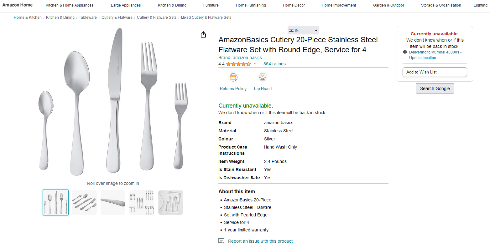
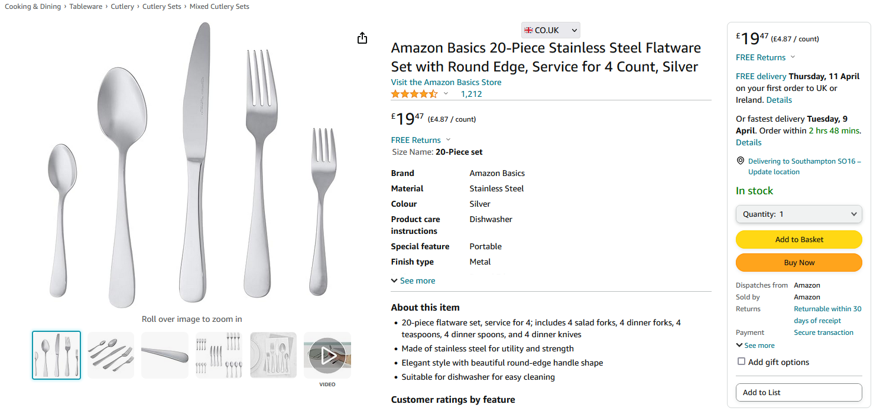
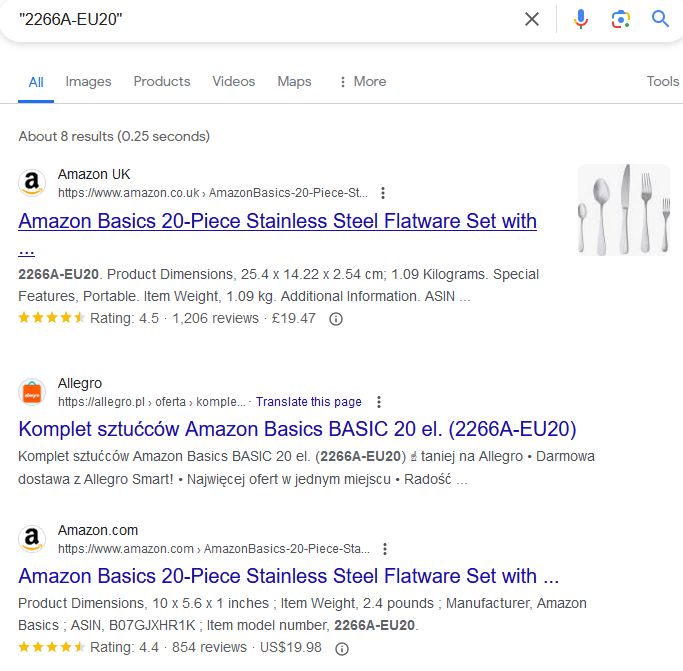

# amazon-redirect-plus

  

***

***
Effortlessly switch between different Amazon fronts and search for products on Google (or your choice of search engine) with this browser extension. Easily navigate global Amazon storefronts using and quickly search for unavailable items. Enhance your shopping experience today!

# Screenshots
Product missing in amazon.in

Check the same product in UK store by changing to amazon.co.uk

Result of clicking on Search Google Button :)
